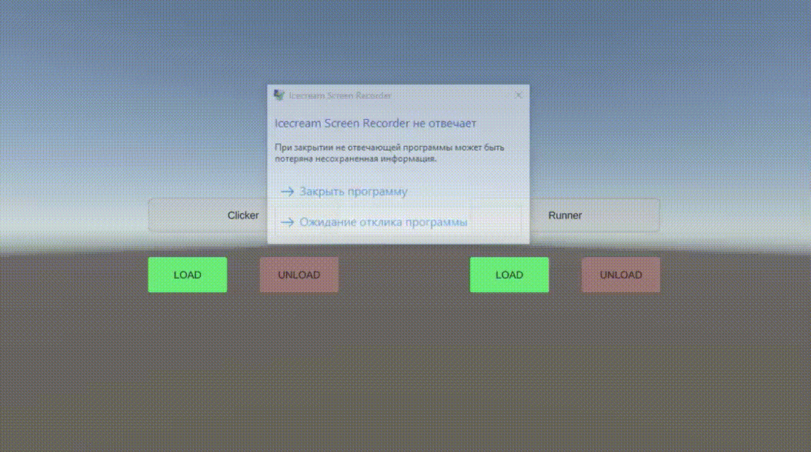

# Превью выполненного тестового задания
Версия Unity: 2022.3.19f1

Цель: Разработать лаунчер мини-игр и 2 простые мини-игры для тестов. Особенностью ТЗ является то, что все данные и ассеты из игр должны находиться на сервере и загружаться\выгружаться с устройства пользователя по требованию самого пользователя (Кнопки на главном меню). 

